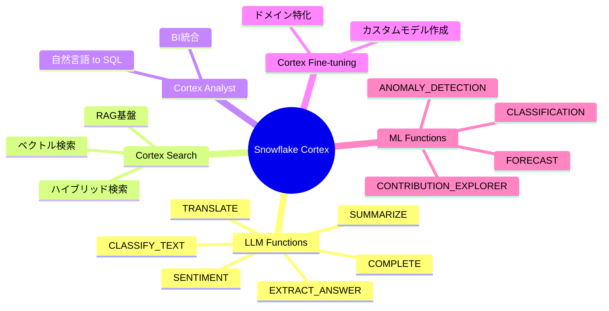
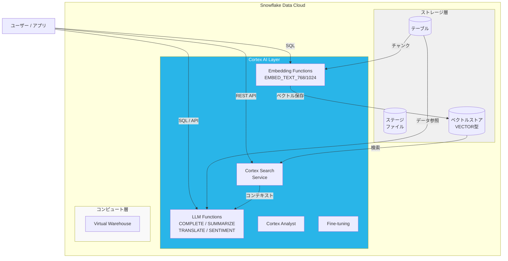

# Snowflake Cortex 概要

## Cortex とは

Snowflake Cortex は、Snowflake が提供する **フルマネージドの AI・ML サービス群** です。データウェアハウス内のデータに対して、追加のインフラ管理なしに LLM（大規模言語モデル）や ML 機能を直接活用できます。

> **ポイント**: データをデータウェアハウスの外に出す必要がないため、セキュリティやガバナンスを維持したまま AI を活用できます。

---

## Cortex の主要コンポーネント



---

## LLM Functions 一覧

| 関数名 | 用途 | 入力 | 出力 |
|--------|------|------|------|
| `COMPLETE` | 汎用的なテキスト生成・質問応答 | プロンプト文字列 | テキスト |
| `SUMMARIZE` | テキスト要約 | 長文テキスト | 要約文 |
| `TRANSLATE` | 翻訳 | テキスト + 言語指定 | 翻訳文 |
| `SENTIMENT` | 感情分析 | テキスト | positive/negative/neutral |
| `EXTRACT_ANSWER` | 質問応答（文脈から抽出） | 文脈 + 質問 | 回答文字列 |
| `CLASSIFY_TEXT` | テキスト分類 | テキスト + カテゴリリスト | カテゴリ |
| `EMBED_TEXT_768` | テキストをベクトル化（768次元） | テキスト | VECTOR型 |
| `EMBED_TEXT_1024` | テキストをベクトル化（1024次元） | テキスト | VECTOR型 |

---

## 利用可能な LLM モデル

`COMPLETE` 関数などで指定可能な主要モデル：

```sql
-- 利用可能なモデル例
'snowflake-arctic'           -- Snowflake独自モデル（コスト効率重視）
'mistral-large2'             -- Mistral Large 2
'mistral-7b'                 -- Mistral 7B（軽量・高速）
'llama3.1-70b'               -- Meta Llama 3.1 70B
'llama3.1-8b'                -- Meta Llama 3.1 8B
'llama3.2-1b'                -- Meta Llama 3.2 1B
'claude-3-5-sonnet'          -- Anthropic Claude 3.5 Sonnet
'claude-3-haiku'             -- Anthropic Claude 3 Haiku
'gemma-7b'                   -- Google Gemma 7B
'mixtral-8x7b'               -- Mistral Mixtral 8x7B
'reka-flash'                 -- Reka Flash
'jamba-1.5-mini'             -- AI21 Jamba 1.5 Mini
```

---

## Cortex のアーキテクチャ



---

## Cortex の特徴と利点

### 1. データガバナンスの維持
- データが Snowflake 環境の外に出ない
- 既存のロールベースアクセス制御（RBAC）が適用される
- コンプライアンス要件を満たしやすい

### 2. ゼロコピー統合
- 既存の Snowflake テーブルに対してそのまま AI 処理が可能
- データの複製・移行が不要

### 3. SQL ファーストのインターフェース
- 既存の SQL スキルをそのまま活用
- 複雑な Python 環境の構築が不要

### 4. スケーラビリティ
- Snowflake の仮想ウェアハウスのスケーリングに従って AI 処理もスケール

---

## クイックスタート：最初の Cortex 呼び出し

```sql
-- 必要な権限設定
USE ROLE ACCOUNTADMIN;
GRANT DATABASE ROLE SNOWFLAKE.CORTEX_USER TO ROLE <your_role>;

-- 基本的なテキスト生成
SELECT SNOWFLAKE.CORTEX.COMPLETE(
    'snowflake-arctic',
    'Snowflake Cortexとは何ですか？日本語で簡潔に説明してください。'
) AS response;

-- 感情分析
SELECT SNOWFLAKE.CORTEX.SENTIMENT(
    'このサービスは本当に素晴らしいです！大満足です。'
) AS sentiment_score;
-- 出力例: 0.95 (1に近いほどポジティブ)

-- テキスト要約
SELECT SNOWFLAKE.CORTEX.SUMMARIZE(
    '長い文章テキスト...'
) AS summary;
```

---

## 次のステップ

- [Cortex Search + RAG の概要](../../cortex_search_rag/docs/01_overview.md) — RAG と Cortex Search を理解する
- [RAG の構成要素](../../cortex_search_rag/docs/02_rag_components.md) — チャンキング・Embedding・検索の仕組み
- [Cortex Analyst の概要](../../cortex_analyst/docs/01_cortex_analyst_overview.md) — 自然言語 → SQL の仕組みと活用
- [Cortex Agent の概要](../../cortex_agent/docs/01_agent_overview.md) — 複数ツールを統合するエージェント基盤
