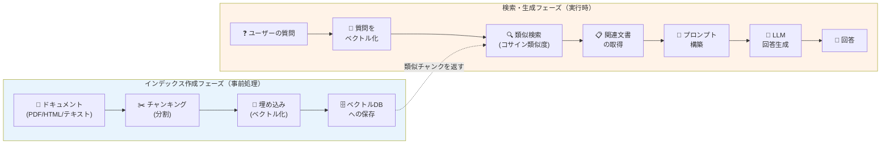
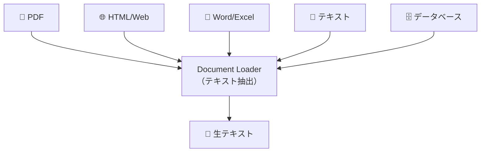
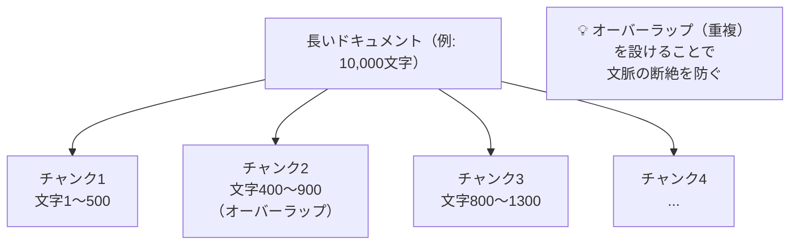
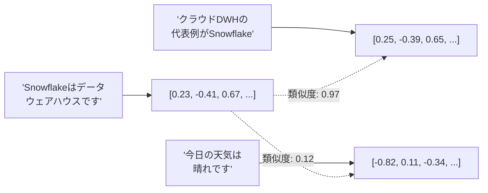
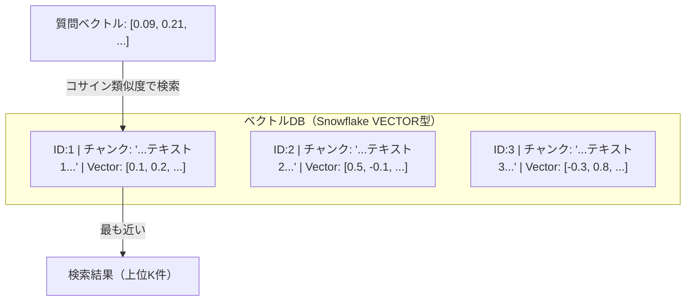
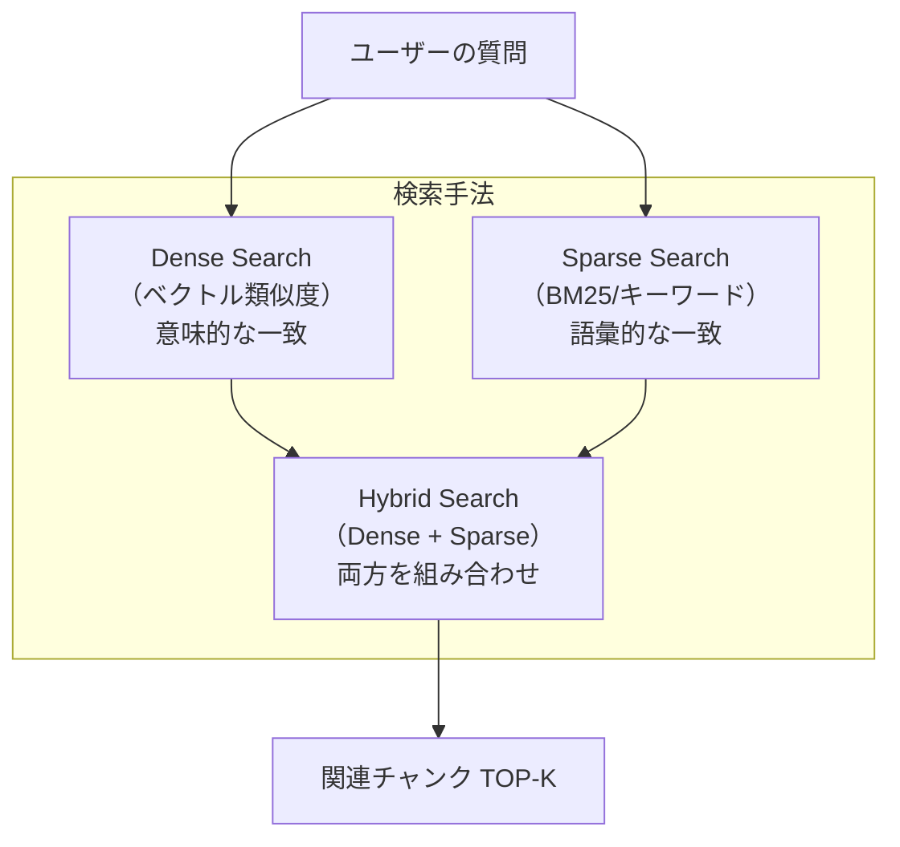
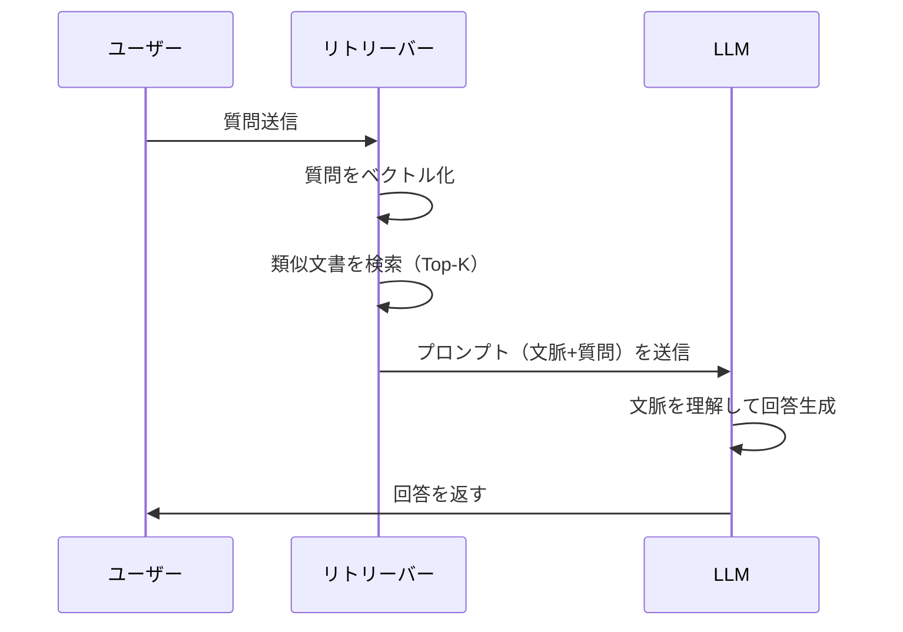
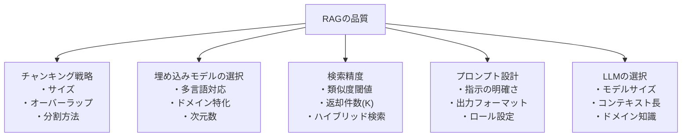

# RAGの構成要素

## RAG とは（初学者向け）

**RAG（Retrieval-Augmented Generation）** とは、「**検索拡張生成**」とも呼ばれる手法です。

### わかりやすい例えで理解する

> **試験を受ける学生の例**
>
> - **LLM のみ（RAG なし）**: 試験前に暗記した知識だけで回答する。最新情報や専門知識が不足することも。
> - **RAG あり**: 試験中に参考書（= ドキュメント）を参照しながら回答する。正確な情報に基づいた回答が可能。

RAG は LLM の「知識の限界」を補うための仕組みです。

---

## RAG が解決する問題

| 問題 | 内容 | RAGによる解決 |
|------|------|---------------|
| 知識のカットオフ | LLMは学習データの日付以降の情報を知らない | 最新ドキュメントを検索して参照 |
| ハルシネーション | LLMが嘘の情報を自信満々に回答する | 根拠となる文書を明示できる |
| 社内固有知識 | 公開されていない社内情報をLLMは知らない | 社内ドキュメントをインデックス化 |
| コスト | 全情報をプロンプトに含めると高コスト | 必要な情報だけを検索して渡す |

---

## RAGの全体像



---

## 構成要素の詳細

### 1. ドキュメントローダー（Document Loader）

ドキュメントを読み込む処理です。



**Snowflake でのアプローチ**:
- ステージにファイルをアップロード
- `PARSE_DOCUMENT` 関数でテキスト抽出
- テーブルに格納してからチャンキング

---

### 2. チャンキング（Chunking）

長いドキュメントを適切なサイズに分割します。



**チャンクサイズの目安**:

| 用途 | チャンクサイズ | オーバーラップ |
|------|---------------|----------------|
| 短い質問応答 | 200〜500文字 | 50〜100文字 |
| 詳細な説明が必要 | 500〜1000文字 | 100〜200文字 |
| 長文要約 | 1000〜2000文字 | 200〜400文字 |

---

### 3. 埋め込みモデル（Embedding Model）

テキストを数値ベクトルに変換します。意味的に近いテキストは、ベクトル空間でも近い位置に配置されます。



**Snowflake Cortex の埋め込み関数**:
```sql
-- 768次元ベクトル（軽量・高速）
SELECT SNOWFLAKE.CORTEX.EMBED_TEXT_768(
    'snowflake-arctic-embed-m',
    'テキスト内容'
) AS vector;

-- 1024次元ベクトル（高精度）
SELECT SNOWFLAKE.CORTEX.EMBED_TEXT_1024(
    'voyage-multilingual-2',  -- 多言語対応
    'テキスト内容'
) AS vector;
```

---

### 4. ベクトルデータベース（Vector Database）

ベクトルを保存し、類似ベクトルを高速に検索するためのデータストアです。



**Snowflake でのベクトルデータ型**:
```sql
-- VECTOR型の定義
CREATE TABLE document_chunks (
    id          NUMBER AUTOINCREMENT PRIMARY KEY,
    doc_name    VARCHAR,
    chunk_text  VARCHAR,
    chunk_vec   VECTOR(FLOAT, 768)  -- 768次元ベクトル
);
```

---

### 5. リトリーバー（Retriever）

クエリに関連するチャンクを検索する処理です。



**Snowflake でのベクトル検索**:
```sql
-- コサイン類似度による検索（VECTOR_COSINE_SIMILARITY）
SELECT
    chunk_text,
    VECTOR_COSINE_SIMILARITY(chunk_vec, :query_vec) AS similarity
FROM document_chunks
ORDER BY similarity DESC
LIMIT 5;
```

---

### 6. プロンプトエンジニアリング（Prompt Engineering）

検索したコンテキストと質問を組み合わせて、LLM への指示を構築します。

```
┌─────────────────────────────────────────────────┐
│ システムプロンプト                                │
│ "あなたは○○の専門家です。以下の文脈のみを使って │
│  質問に答えてください。わからない場合は          │
│  'わかりません'と答えてください。"               │
├─────────────────────────────────────────────────┤
│ 検索されたコンテキスト（文脈）                   │
│ "文書1: ...チャンク1の内容..."                   │
│ "文書2: ...チャンク2の内容..."                   │
│ "文書3: ...チャンク3の内容..."                   │
├─────────────────────────────────────────────────┤
│ ユーザーの質問                                   │
│ "Snowflake Cortexの料金体系を教えてください"     │
└─────────────────────────────────────────────────┘
```

---

### 7. LLM（大規模言語モデル）

コンテキストを理解し、回答を生成します。



---

## RAG の品質を決める重要因子



---

## 次のステップ

- [Cortexを使ったRAGサンプル](./04_cortex_rag_sample.md) - 実際にコードを書いてみる
- [デモアプリ作成](./05_demo_app.md) - Streamlit でアプリを構築する
