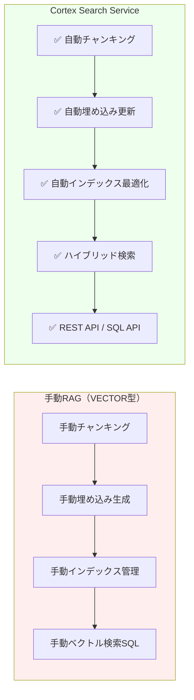
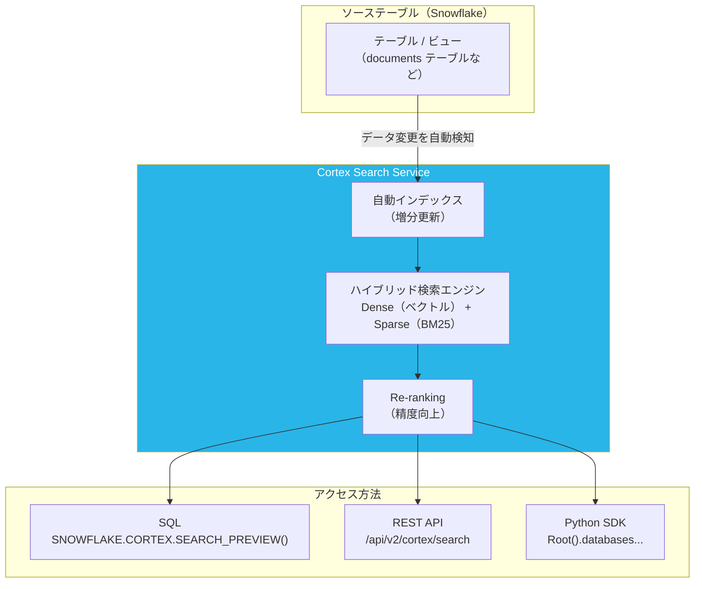
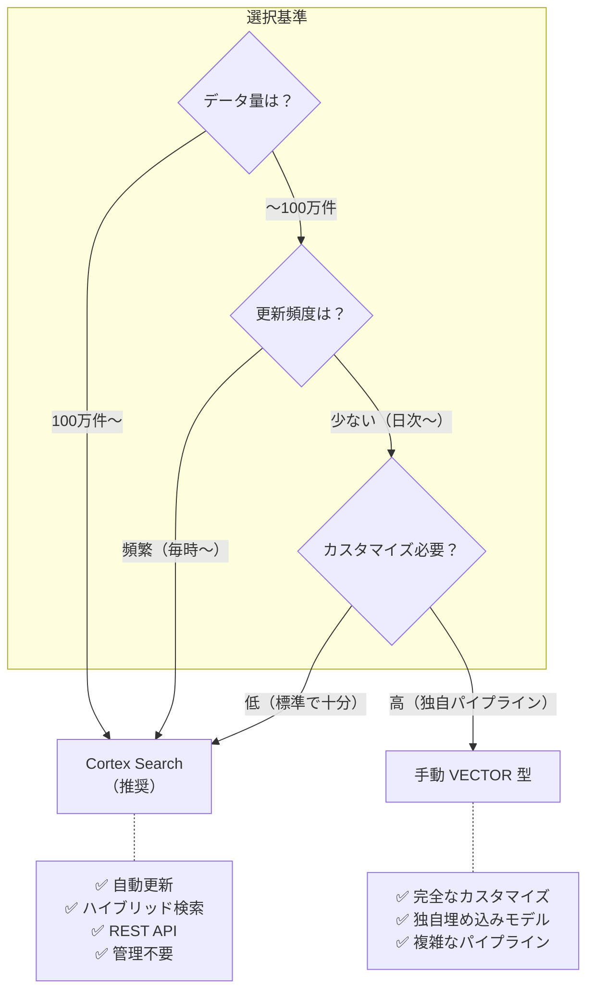
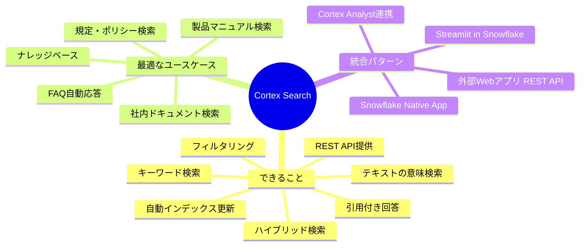

# Cortex Search でできること・サンプルコード

## Cortex Search とは

Cortex Search は、Snowflake が提供する **フルマネージドの検索サービス**です。前章の手動ベクトル検索（VECTOR型 + EMBED_TEXT）と比較して、以下の点が自動化・最適化されます。



---

## Cortex Search の機能一覧

| 機能 | 内容 |
|------|------|
| **自動インデックス管理** | テーブルデータの変更を自動検知して増分更新 |
| **ハイブリッド検索** | ベクトル（意味）検索 + キーワード（BM25）検索を統合 |
| **マルチカラム検索** | 複数カラムをまたいで検索可能 |
| **フィルタリング** | 属性（メタデータ）によるフィルタ検索 |
| **REST API** | アプリから HTTP で直接呼び出し可能 |
| **Python SDK** | Snowpark コンテナから直接呼び出し |
| **Streamlit 統合** | `st.experimental_connection` でシームレスに連携 |
| **引用（Citation）** | 回答の根拠となるチャンクを自動付与 |

---

## アーキテクチャ



---

## Step 1: Cortex Search Service の作成

```sql
-- ========================================
-- Cortex Search Service のセットアップ
-- ========================================
USE ROLE SYSADMIN;
USE DATABASE RAG_DEMO_DB;
USE SCHEMA RAG_DEMO_DB.RAG_SCHEMA;

-- 1. ソーステーブルの準備（既存テーブルに対しても作成可能）
CREATE OR REPLACE TABLE company_documents (
    doc_id       VARCHAR DEFAULT UUID_STRING() PRIMARY KEY,
    doc_name     VARCHAR NOT NULL,           -- ドキュメント名
    category     VARCHAR,                    -- カテゴリ（フィルタ用）
    department   VARCHAR,                    -- 部署（フィルタ用）
    content      VARCHAR NOT NULL,           -- 検索対象テキスト
    created_at   TIMESTAMP DEFAULT CURRENT_TIMESTAMP(),
    updated_at   TIMESTAMP DEFAULT CURRENT_TIMESTAMP()
);

-- サンプルデータ挿入
INSERT INTO company_documents (doc_name, category, department, content) VALUES
('有給休暇規定', '人事規定', '人事部',
 '有給休暇は入社から6ヶ月経過後に10日付与されます。その後は1年ごとに勤続年数に応じて最大20日まで増加します。有給休暇の申請は原則として3営業日前までに直属の上長に申請してください。'),
('在宅勤務規定', '就業規則', '人事部',
 '在宅勤務（テレワーク）は週3日まで利用可能です。在宅勤務を行う際は、前日の18時までにチームSlackチャンネルに申告してください。セキュリティ上の理由から、公共のWi-Fiでの業務は禁止されています。'),
('経費精算規定', '財務規定', '経理部',
 '経費精算は発生日から30日以内に申請してください。交通費は実費精算です。接待費の上限は1人あたり10,000円です。領収書は原本またはスキャンデータの提出が必要です。'),
('Snowflake利用ガイド', 'IT規定', '情報システム部',
 'Snowflakeの仮想ウェアハウスは使用後は必ず停止してください。本番環境へのアクセスは申請ベースで付与されます。クエリ実行前にWHERE句でデータを絞り込み、フルスキャンを避けてください。'),
('セキュリティポリシー', 'IT規定', '情報システム部',
 'パスワードは12文字以上で、英大文字・英小文字・数字・特殊文字を含む必要があります。多要素認証（MFA）は全システムで必須です。不審なメールを受信した場合はITセキュリティチームに即座に報告してください。');

-- 2. Cortex Search Service の作成
CREATE OR REPLACE CORTEX SEARCH SERVICE company_doc_search
    ON content                              -- 検索対象カラム
    ATTRIBUTES doc_name, category, department  -- フィルタ用属性
    WAREHOUSE = COMPUTE_WH
    TARGET_LAG = '1 minute'                -- インデックス更新頻度
AS (
    SELECT
        doc_id,
        doc_name,
        category,
        department,
        content,
        updated_at
    FROM company_documents
);

-- 作成確認
SHOW CORTEX SEARCH SERVICES;
DESCRIBE CORTEX SEARCH SERVICE company_doc_search;
```

---

## Step 2: SQL での検索

```sql
-- ========================================
-- 基本的な検索
-- ========================================

-- シンプルな検索
SELECT PARSE_JSON(
    SNOWFLAKE.CORTEX.SEARCH_PREVIEW(
        'company_doc_search',  -- サービス名
        '{
            "query": "有給休暇の申請方法",
            "columns": ["doc_name", "content", "category"],
            "limit": 3
        }'
    )
) AS search_result;

-- ========================================
-- フィルタ付き検索
-- ========================================

-- 人事部のドキュメントのみを検索
SELECT PARSE_JSON(
    SNOWFLAKE.CORTEX.SEARCH_PREVIEW(
        'company_doc_search',
        '{
            "query": "在宅勤務のルール",
            "columns": ["doc_name", "content", "department"],
            "filter": {
                "@eq": {"department": "人事部"}
            },
            "limit": 3
        }'
    )
) AS search_result;

-- 複数条件フィルタ（OR）
SELECT PARSE_JSON(
    SNOWFLAKE.CORTEX.SEARCH_PREVIEW(
        'company_doc_search',
        '{
            "query": "セキュリティ対策",
            "columns": ["doc_name", "content", "category", "department"],
            "filter": {
                "@or": [
                    {"@eq": {"category": "IT規定"}},
                    {"@eq": {"department": "情報システム部"}}
                ]
            },
            "limit": 5
        }'
    )
) AS search_result;

-- ========================================
-- 結果をテーブル形式に展開
-- ========================================
WITH search_raw AS (
    SELECT PARSE_JSON(
        SNOWFLAKE.CORTEX.SEARCH_PREVIEW(
            'company_doc_search',
            '{
                "query": "経費の申請期限",
                "columns": ["doc_name", "content", "category"],
                "limit": 3
            }'
        )
    ) AS result
),
results_expanded AS (
    SELECT
        r.value:doc_name::VARCHAR AS doc_name,
        r.value:category::VARCHAR AS category,
        r.value:content::VARCHAR AS content,
        r.value:"@search_score"::FLOAT AS search_score
    FROM search_raw,
        LATERAL FLATTEN(input => result:results) r
)
SELECT * FROM results_expanded ORDER BY search_score DESC;
```

---

## Step 3: Cortex Search + LLM で完全な RAG

```sql
-- ========================================
-- Cortex Search + COMPLETE による RAG
-- ========================================
CREATE OR REPLACE PROCEDURE cortex_search_rag(
    query_text  VARCHAR,
    department_filter VARCHAR DEFAULT NULL,
    llm_model   VARCHAR DEFAULT 'snowflake-arctic',
    result_count NUMBER DEFAULT 3
)
RETURNS OBJECT
LANGUAGE PYTHON
RUNTIME_VERSION = '3.11'
PACKAGES = ('snowflake-snowpark-python')
HANDLER = 'run'
AS
$$
import json
from snowflake.snowpark import Session

def run(session: Session, query_text: str, department_filter: str,
        llm_model: str, result_count: int) -> dict:

    # 1. 検索クエリの構築
    search_query = {
        "query": query_text,
        "columns": ["doc_name", "content", "category", "department"],
        "limit": result_count
    }

    # 部署フィルタがある場合は追加
    if department_filter:
        search_query["filter"] = {"@eq": {"department": department_filter}}

    # 2. Cortex Search で関連文書を検索
    search_result_json = session.sql(
        f"""SELECT SNOWFLAKE.CORTEX.SEARCH_PREVIEW(
            'company_doc_search',
            PARSE_JSON($${ json.dumps(search_query, ensure_ascii=False) }$$)::VARCHAR
        ) AS result"""
    ).collect()[0]["RESULT"]

    search_data = json.loads(search_result_json)
    results = search_data.get("results", [])

    if not results:
        return {
            "answer": "関連するドキュメントが見つかりませんでした。",
            "sources": [],
            "found_count": 0
        }

    # 3. コンテキストの構築
    context_parts = []
    sources = []
    for i, r in enumerate(results, 1):
        context_parts.append(
            f"[{i}] 【{r.get('doc_name', '')}】（{r.get('department', '')}）\n"
            f"{r.get('content', '')}"
        )
        sources.append({
            "rank": i,
            "doc_name": r.get("doc_name"),
            "department": r.get("department"),
            "category": r.get("category"),
            "score": r.get("@search_score")
        })

    context_text = "\n\n".join(context_parts)

    # 4. LLM で回答生成
    prompt = f"""以下の社内文書を参考に、質問に日本語で回答してください。
参照した文書番号を[1]のように明記してください。
文書に記載のない内容は「記載がありません」と答えてください。

=== 参考文書 ===
{context_text}

=== 質問 ===
{query_text}

=== 回答 ==="""

    answer = session.sql(
        f"""SELECT SNOWFLAKE.CORTEX.COMPLETE(
            '{llm_model}',
            $${prompt.replace("'", "''")}$$
        ) AS answer"""
    ).collect()[0]["ANSWER"]

    return {
        "answer": answer,
        "sources": sources,
        "found_count": len(results)
    }
$$;

-- テスト実行
CALL cortex_search_rag('在宅勤務の申請方法を教えてください');
CALL cortex_search_rag('セキュリティ上の注意点', '情報システム部', 'llama3.1-70b', 3);
```

---

## Step 4: REST API での利用

```bash
# REST API を使ってアプリから直接呼び出す

# 認証トークンの取得（SnowflakeのOAuth/JWT）
TOKEN=$(curl -s -X POST \
  "https://<account>.snowflakecomputing.com/oauth/token-request" \
  -H "Content-Type: application/x-www-form-urlencoded" \
  -d "grant_type=password&username=<user>&password=<pass>&scope=session:role:SYSADMIN")

JWT=$(echo $TOKEN | python3 -c "import sys,json; print(json.load(sys.stdin)['access_token'])")

# Cortex Search REST API 呼び出し
curl -X POST \
  "https://<account>.snowflakecomputing.com/api/v2/cortex/search:query" \
  -H "Authorization: Bearer $JWT" \
  -H "Content-Type: application/json" \
  -H "X-Snowflake-Authorization-Token-Type: OAUTH" \
  -d '{
    "query": "有給休暇の取得方法",
    "columns": ["doc_name", "content", "category"],
    "filter": {"@eq": {"department": "人事部"}},
    "limit": 3,
    "search_service": "RAG_DEMO_DB.RAG_SCHEMA.company_doc_search"
  }'
```

---

## Step 5: Python SDK での利用（Snowpark Container Services）

```python
# Python SDK を使った Cortex Search
from snowflake.core import Root
from snowflake.snowpark import Session

# セッションの作成
session = Session.builder.configs({
    "account": "<account>",
    "user": "<user>",
    "password": "<password>",
    "role": "SYSADMIN",
    "warehouse": "COMPUTE_WH",
    "database": "RAG_DEMO_DB",
    "schema": "RAG_SCHEMA"
}).create()

# Cortex Search Service への参照
root = Root(session)
search_service = (
    root
    .databases["RAG_DEMO_DB"]
    .schemas["RAG_SCHEMA"]
    .cortex_search_services["company_doc_search"]
)

# 検索実行
resp = search_service.search(
    query="在宅勤務はどのくらい利用できますか？",
    columns=["doc_name", "content", "department"],
    filter={"@eq": {"department": "人事部"}},
    limit=3
)

# 結果の処理
for result in resp.results:
    print(f"ドキュメント: {result['doc_name']}")
    print(f"スコア: {result.get('@search_score', 'N/A')}")
    print(f"内容: {result['content'][:200]}...")
    print("---")

# Streamlit in Snowflake での使用例
# （st.connection を使った簡略化）
import streamlit as st
from snowflake.snowpark.context import get_active_session

session = get_active_session()
root = Root(session)

search_service = (
    root
    .databases["RAG_DEMO_DB"]
    .schemas["RAG_SCHEMA"]
    .cortex_search_services["company_doc_search"]
)

# Streamlit UI
query = st.text_input("検索キーワード")
if query:
    results = search_service.search(query=query, columns=["doc_name", "content"], limit=5)
    for r in results.results:
        with st.expander(r["doc_name"]):
            st.write(r["content"])
```

---

## 手動 VECTOR 型 vs Cortex Search 比較

### 工程の対照

手動RAGは以下の工程をすべて自前で実装する必要があります。
Cortex Search ではそのほとんどが**自動・不要**になります。

```
【手動RAG の流れ】

[生データ]
    ↓ 手動: SPLIT + LATERAL FLATTEN でチャンク分割
    ↓ 手動: EMBED_TEXT_768 でベクトル生成・テーブル保存
    ↓ 手動: クエリも毎回 EMBED_TEXT_768 でベクトル化
    ↓ 手動: VECTOR_COSINE_SIMILARITY で全件スキャン
    ↓ 手動: スコア閾値フィルタを自前実装
    ↓ データ追加時は手動で再INSERT + 再ベクトル化
    ↓ CORTEX.COMPLETE で回答生成

【Cortex Search の流れ】

[生データ]
    ↓ 自動: チャンキング（内部処理、コード不要）
    ↓ 自動: 埋め込み生成・インデックス構築（内部処理）
    ↓ 自動: TARGET_LAG でデータ追加を検知・差分更新
    ↓ SEARCH_PREVIEW 1行呼ぶだけ
    ↓ CORTEX.COMPLETE で回答生成
```

### 省略できる工程の一覧

| 工程 | 手動RAG | Cortex Search |
|---|---|---|
| チャンキング | `LATERAL FLATTEN(SPLIT(...))` 手書き | **省略可**（自動） |
| ベクトル生成 | `EMBED_TEXT_768` を明示的に呼ぶ | **省略可**（自動） |
| ベクトル保存テーブル | `document_chunks_vec` テーブル管理 | **省略可**（不要） |
| クエリのベクトル化 | 毎回 `EMBED_TEXT_768` | **省略可**（自動） |
| 類似度計算 | `VECTOR_COSINE_SIMILARITY` 全件スキャン | **省略可**（自動） |
| データ追加時の再インデックス | 手動で再 INSERT + 再ベクトル化 | **省略可**（TARGET_LAGで自動） |
| スコア閾値管理 | `WHERE score >= 0.5` など手動チューニング | Rerankerが自動ソート |

### 検索品質の差（最大の強み）

手動RAGはベクトル類似度の **1種類のスコア** のみを使います：

```sql
-- 手動RAG
VECTOR_COSINE_SIMILARITY(c.chunk_vec, q.vec) AS score
```

Cortex Search は **3種類のスコアを合算した Reranker** の結果が返ります：

```sql
-- Cortex Search（05_cortex_search_setup.sql Step 3 参照）
r.value:"@search_score":reranker_score::FLOAT   -- 最終スコア（これを使う）
r.value:"@search_score":cosine_similarity::FLOAT -- ベクトル類似度
r.value:"@search_score":text_match::FLOAT        -- BM25 テキストマッチ
```

| 検索手法 | 手動RAG | Cortex Search |
|---|---|---|
| ベクトル検索（意味） | ✅ | ✅ |
| キーワード検索（BM25） | ❌ | ✅ |
| Reranker（再ランキング） | ❌ | ✅ |
| ANNインデックス（高速化） | ❌（全件スキャン） | ✅ |

「有給休暇」のような単純なクエリは手動RAGでも問題なく動作しますが、複合的な質問や大量データになるほど Cortex Search の精度・速度が上回ります。

### このデモでの位置づけ

| ファイル | 目的 |
|---|---|
| `sql/03_chunking_and_embedding.sql` | RAGの**仕組みを学ぶ**ためのファイル |
| `sql/04_rag_queries.sql` | ベクトル検索の**理論を理解する**ためのファイル |
| `sql/05_cortex_search_setup.sql` | **本番で使う**ファイル（03・04の工程をSnowflakeが内包） |

実務では03・04で仕組みを理解した上で05を使うのが理想的な学習順序です。

### 使い分けの判断軸

| 状況 | 向いている方式 |
|---|---|
| チャンキング戦略を細かく制御したい | 手動RAG |
| 埋め込みモデルを自分で選びたい | 手動RAG |
| ベクトルデータを他の用途にも使いたい | 手動RAG |
| とにかく早く動かしたい | **Cortex Search** |
| データが頻繁に更新される | **Cortex Search** |
| 検索精度を最大化したい | **Cortex Search** |
| 運用コスト（管理負荷）を下げたい | **Cortex Search** |

### 選択フローチャート



---

## パフォーマンス最適化

```sql
-- ========================================
-- Cortex Search の最適化設定
-- ========================================

-- TARGET_LAG の調整（リアルタイム性 vs コスト）
ALTER CORTEX SEARCH SERVICE company_doc_search
    SET TARGET_LAG = '5 minutes';  -- デフォルト: 1分

-- データ更新の手動トリガー
ALTER CORTEX SEARCH SERVICE company_doc_search RESUME;

-- サービスの一時停止（コスト削減）
ALTER CORTEX SEARCH SERVICE company_doc_search SUSPEND;

-- サービスの状態確認
SHOW CORTEX SEARCH SERVICES;

-- SHOW結果をテーブル形式で参照する場合
SELECT
    "name",
    "state",
    "target_lag",
    "data_timestamp"
FROM TABLE(RESULT_SCAN(LAST_QUERY_ID()));

-- 検索結果数の最適化（precision vs recall のトレードオフ）
-- limit: 低い値（3〜5）→ 精度重視
-- limit: 高い値（10〜20）→ 網羅性重視（Re-rankingで品質維持）
```

---

## まとめ：Cortex Search の位置づけ



---

## 参考リンク

- [Snowflake Cortex Search 公式ドキュメント](https://docs.snowflake.com/en/user-guide/snowflake-cortex/cortex-search/cortex-search-overview)
- [Cortex LLM Functions](https://docs.snowflake.com/en/user-guide/snowflake-cortex/llm-functions)
- [Streamlit in Snowflake](https://docs.snowflake.com/en/developer-guide/streamlit/about-streamlit)
- [Vector Embeddings in Snowflake](https://docs.snowflake.com/en/user-guide/snowflake-cortex/vector-embeddings)
