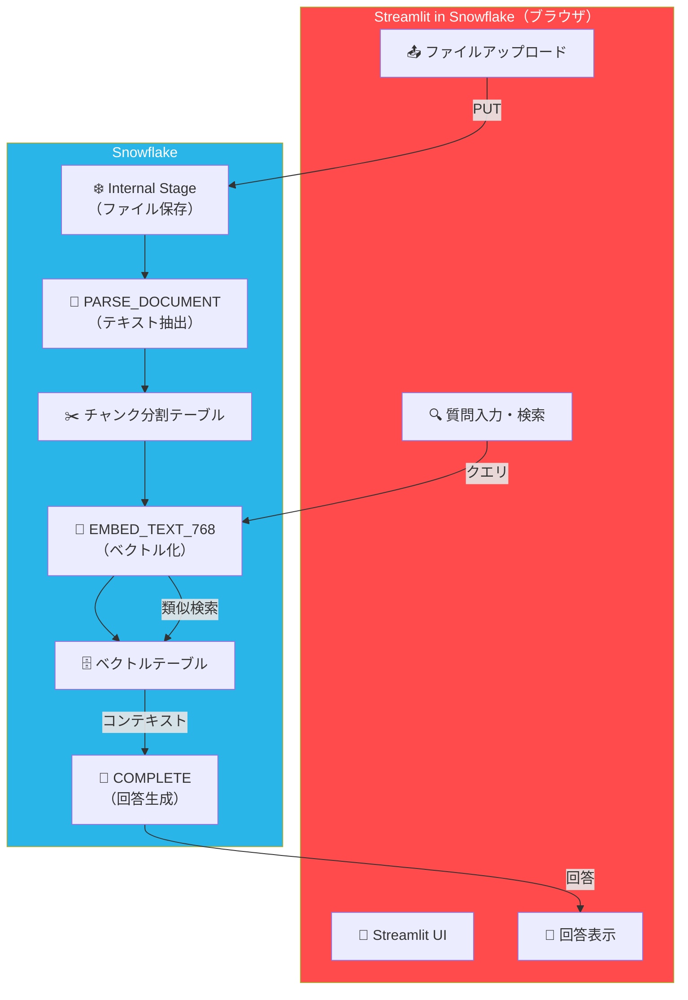
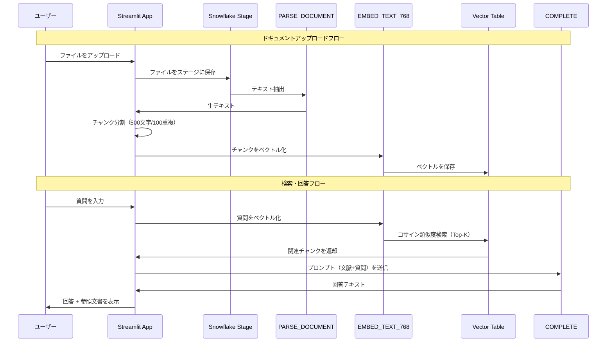

# ドキュメントアップロード + RAG デモアプリ

## 概要

Streamlit in Snowflake（SiS）を使って、ドキュメントをアップロードして RAG + LLM で検索できるデモアプリを作成します。

---

## アーキテクチャ



---

## 前提となるデータベースオブジェクトの作成

まず SQL でテーブルとステージを作成します（`/sql/setup_demo_app.sql` を参照）。

```sql
-- セットアップ（詳細は /sql/setup_demo_app.sql）
USE ROLE SYSADMIN;
USE DATABASE RAG_DEMO_DB;
USE SCHEMA RAG_DEMO_DB.RAG_SCHEMA;

CREATE STAGE IF NOT EXISTS doc_stage
    DIRECTORY = (ENABLE = TRUE)
    ENCRYPTION = (TYPE = 'SNOWFLAKE_SSE');

CREATE TABLE IF NOT EXISTS uploaded_documents (
    doc_id       VARCHAR DEFAULT UUID_STRING() PRIMARY KEY,
    file_name    VARCHAR,
    file_type    VARCHAR,
    raw_content  VARCHAR,
    uploaded_at  TIMESTAMP DEFAULT CURRENT_TIMESTAMP(),
    uploaded_by  VARCHAR DEFAULT CURRENT_USER()
);

CREATE TABLE IF NOT EXISTS doc_chunks_with_vec (
    chunk_id    NUMBER AUTOINCREMENT PRIMARY KEY,
    doc_id      VARCHAR,
    file_name   VARCHAR,
    chunk_text  VARCHAR,
    chunk_index NUMBER,
    chunk_vec   VECTOR(FLOAT, 768),
    created_at  TIMESTAMP DEFAULT CURRENT_TIMESTAMP()
);
```

---

## Streamlit アプリのコード

Snowflake の Streamlit エディタに以下のコードを貼り付けてください。

```python
# streamlit_rag_app.py
import streamlit as st
import pandas as pd
from snowflake.snowpark.context import get_active_session
from snowflake.snowpark.functions import col, lit, call_function
import json

# ========================================
# セッション・設定
# ========================================
session = get_active_session()

st.set_page_config(
    page_title="社内ドキュメント RAG 検索",
    page_icon="❄️",
    layout="wide"
)

# モデル選択肢
EMBEDDING_MODELS = {
    "snowflake-arctic-embed-m (日本語対応・標準)": "snowflake-arctic-embed-m",
    "voyage-multilingual-2 (多言語・高精度)": "voyage-multilingual-2",
}
LLM_MODELS = {
    "Snowflake Arctic (高速・低コスト)": "snowflake-arctic",
    "Llama 3.1 70B (高精度)": "llama3.1-70b",
    "Llama 3.1 8B (高速)": "llama3.1-8b",
    "Mistral Large 2": "mistral-large2",
}

CHUNK_SIZE = 500      # チャンクサイズ（文字数）
CHUNK_OVERLAP = 100   # オーバーラップ（文字数）


# ========================================
# ユーティリティ関数
# ========================================
def chunk_text(text: str, chunk_size: int = CHUNK_SIZE, overlap: int = CHUNK_OVERLAP) -> list[str]:
    """テキストをオーバーラップ付きでチャンク分割"""
    chunks = []
    start = 0
    while start < len(text):
        end = start + chunk_size
        chunk = text[start:end]
        if chunk.strip():
            chunks.append(chunk.strip())
        start += chunk_size - overlap
    return chunks


def process_document(file_name: str, content: str, embed_model: str) -> int:
    """ドキュメントを処理してベクトルDBに保存"""
    # 1. ドキュメント保存
    doc_df = session.create_dataframe(
        [{"file_name": file_name, "file_type": file_name.split(".")[-1], "raw_content": content}]
    )
    doc_df.write.mode("append").save_as_table("uploaded_documents")

    # doc_idを取得
    doc_id = session.sql(
        f"SELECT doc_id FROM uploaded_documents WHERE file_name = '{file_name}' ORDER BY uploaded_at DESC LIMIT 1"
    ).collect()[0]["DOC_ID"]

    # 2. チャンキング
    chunks = chunk_text(content)

    # 3. 埋め込み生成 & 保存
    chunk_data = []
    for i, chunk in enumerate(chunks):
        chunk_data.append({
            "doc_id": doc_id,
            "file_name": file_name,
            "chunk_text": chunk,
            "chunk_index": i
        })

    if chunk_data:
        chunks_df = session.create_dataframe(chunk_data)
        chunks_df.create_or_replace_temp_view("temp_chunks")

        # ベクトル化して保存
        session.sql(f"""
            INSERT INTO doc_chunks_with_vec (doc_id, file_name, chunk_text, chunk_index, chunk_vec)
            SELECT
                doc_id,
                file_name,
                chunk_text,
                chunk_index,
                SNOWFLAKE.CORTEX.EMBED_TEXT_768('{embed_model}', chunk_text)
            FROM temp_chunks
        """).collect()

    return len(chunks)


def search_and_answer(
    query: str,
    embed_model: str,
    llm_model: str,
    top_k: int = 3,
    threshold: float = 0.5,
    selected_docs: list = None
) -> dict:
    """RAG検索 + LLM回答生成"""

    # ドキュメントフィルタ条件
    doc_filter = ""
    if selected_docs:
        doc_list = ", ".join([f"'{d}'" for d in selected_docs])
        doc_filter = f"AND file_name IN ({doc_list})"

    result = session.sql(f"""
        WITH query_vec AS (
            SELECT SNOWFLAKE.CORTEX.EMBED_TEXT_768(
                '{embed_model}',
                '{query.replace("'", "''")}'
            ) AS vec
        ),
        top_chunks AS (
            SELECT
                ROW_NUMBER() OVER (ORDER BY VECTOR_COSINE_SIMILARITY(c.chunk_vec, q.vec) DESC) AS rank,
                c.file_name,
                c.chunk_text,
                ROUND(VECTOR_COSINE_SIMILARITY(c.chunk_vec, q.vec), 4) AS score
            FROM doc_chunks_with_vec c, query_vec q
            WHERE VECTOR_COSINE_SIMILARITY(c.chunk_vec, q.vec) >= {threshold}
            {doc_filter}
            ORDER BY score DESC
            LIMIT {top_k}
        ),
        aggregated AS (
            SELECT
                ARRAY_AGG(OBJECT_CONSTRUCT(
                    'rank', rank,
                    'file_name', file_name,
                    'chunk_text', chunk_text,
                    'score', score
                )) AS chunks_json,
                LISTAGG(
                    '[' || rank || '] 【' || file_name || '】\\n' || chunk_text,
                    '\\n\\n'
                ) AS context_text,
                COUNT(*) AS found_count
            FROM top_chunks
        )
        SELECT
            chunks_json,
            found_count,
            CASE
                WHEN found_count = 0 THEN '関連するドキュメントが見つかりませんでした。別のキーワードで試してください。'
                ELSE SNOWFLAKE.CORTEX.COMPLETE(
                    '{llm_model}',
                    CONCAT(
                        'あなたは親切なアシスタントです。以下の参考文書を使って質問に日本語で回答してください。',
                        '回答には参照した文書番号を[1]のように明記してください。',
                        '文書に記載のない内容は「文書に記載がありません」と答えてください。\\n\\n',
                        '=== 参考文書 ===\\n',
                        context_text,
                        '\\n\\n=== 質問 ===\\n',
                        '{query.replace("'", "''")}',
                        '\\n\\n=== 回答 ==='
                    )
                )
            END AS answer
        FROM aggregated
    """).collect()

    if result:
        row = result[0]
        chunks = json.loads(row["CHUNKS_JSON"]) if row["CHUNKS_JSON"] else []
        return {
            "answer": row["ANSWER"],
            "chunks": chunks,
            "found_count": row["FOUND_COUNT"]
        }
    return {"answer": "エラーが発生しました", "chunks": [], "found_count": 0}


# ========================================
# UI レイアウト
# ========================================
st.title("❄️ 社内ドキュメント RAG 検索")
st.caption("ドキュメントをアップロードして、AI で質問に答えます")

tab1, tab2, tab3 = st.tabs(["🔍 検索", "📤 ドキュメント管理", "⚙️ 設定"])

# ========================================
# Tab 1: 検索
# ========================================
with tab1:
    col1, col2 = st.columns([2, 1])

    with col2:
        st.subheader("検索オプション")
        llm_model_label = st.selectbox("LLM モデル", list(LLM_MODELS.keys()))
        llm_model = LLM_MODELS[llm_model_label]

        embed_model_label = st.selectbox("埋め込みモデル", list(EMBEDDING_MODELS.keys()))
        embed_model = EMBEDDING_MODELS[embed_model_label]

        top_k = st.slider("取得チャンク数 (Top-K)", 1, 10, 3)
        threshold = st.slider("類似度閾値", 0.0, 1.0, 0.5, 0.05)

        # 対象ドキュメント選択
        try:
            docs = session.sql(
                "SELECT DISTINCT file_name FROM doc_chunks_with_vec ORDER BY file_name"
            ).to_pandas()["FILE_NAME"].tolist()
        except Exception:
            docs = []

        if docs:
            selected_docs = st.multiselect(
                "検索対象ドキュメント",
                options=docs,
                default=docs,
                help="未選択の場合は全ドキュメントを検索"
            )
        else:
            selected_docs = []
            st.info("ドキュメントタブからドキュメントをアップロードしてください")

    with col1:
        st.subheader("質問を入力")
        query = st.text_area(
            "質問",
            placeholder="例: 有給休暇は何日もらえますか？",
            height=100,
            label_visibility="collapsed"
        )

        if st.button("🔍 検索", type="primary", use_container_width=True):
            if not query.strip():
                st.warning("質問を入力してください")
            elif not docs:
                st.error("先にドキュメントをアップロードしてください")
            else:
                with st.spinner("検索中..."):
                    result = search_and_answer(
                        query, embed_model, llm_model,
                        top_k, threshold,
                        selected_docs if selected_docs else None
                    )

                st.subheader("💬 回答")
                st.success(result["answer"])

                if result["chunks"]:
                    with st.expander(f"📎 参考文書 ({result['found_count']} 件)", expanded=False):
                        for chunk in result["chunks"]:
                            st.markdown(f"**[{chunk['rank']}] {chunk['file_name']}** "
                                        f"(類似度: {chunk['score']:.4f})")
                            st.text(chunk["chunk_text"])
                            st.divider()

# ========================================
# Tab 2: ドキュメント管理
# ========================================
with tab2:
    st.subheader("ドキュメントのアップロード")

    embed_model_label_up = st.selectbox(
        "埋め込みモデル（アップロード時）",
        list(EMBEDDING_MODELS.keys()),
        key="upload_embed"
    )
    embed_model_up = EMBEDDING_MODELS[embed_model_label_up]

    uploaded_files = st.file_uploader(
        "ファイルを選択（TXT, PDF, MD）",
        type=["txt", "pdf", "md"],
        accept_multiple_files=True
    )

    if uploaded_files and st.button("📤 アップロード & インデックス作成", type="primary"):
        for uploaded_file in uploaded_files:
            with st.spinner(f"{uploaded_file.name} を処理中..."):
                try:
                    # テキスト読み込み
                    if uploaded_file.type == "application/pdf":
                        # PDFはPARSE_DOCUMENTで処理（ステージ経由）
                        st.warning(f"{uploaded_file.name}: PDFはステージ経由での処理が必要です")
                        continue
                    else:
                        content = uploaded_file.read().decode("utf-8", errors="replace")

                    chunk_count = process_document(
                        uploaded_file.name, content, embed_model_up
                    )
                    st.success(f"✅ {uploaded_file.name}: {chunk_count} チャンク作成完了")

                except Exception as e:
                    st.error(f"❌ {uploaded_file.name}: エラー - {str(e)}")

    # 登録済みドキュメント一覧
    st.subheader("登録済みドキュメント")
    try:
        doc_stats = session.sql("""
            SELECT
                file_name,
                COUNT(*) AS chunk_count,
                MAX(created_at) AS last_updated
            FROM doc_chunks_with_vec
            GROUP BY file_name
            ORDER BY last_updated DESC
        """).to_pandas()

        if not doc_stats.empty:
            st.dataframe(doc_stats, use_container_width=True)

            # 削除機能
            del_file = st.selectbox("削除するドキュメント", [""] + doc_stats["FILE_NAME"].tolist())
            if del_file and st.button("🗑️ 削除", type="secondary"):
                session.sql(f"""
                    DELETE FROM doc_chunks_with_vec WHERE file_name = '{del_file}'
                """).collect()
                session.sql(f"""
                    DELETE FROM uploaded_documents WHERE file_name = '{del_file}'
                """).collect()
                st.success(f"{del_file} を削除しました")
                st.rerun()
        else:
            st.info("まだドキュメントがありません")
    except Exception as e:
        st.error(f"ドキュメント一覧取得エラー: {e}")

# ========================================
# Tab 3: 設定・デバッグ
# ========================================
with tab3:
    st.subheader("統計情報")
    try:
        stats = session.sql("""
            SELECT
                COUNT(DISTINCT file_name) AS doc_count,
                COUNT(*) AS total_chunks
            FROM doc_chunks_with_vec
        """).collect()[0]
        col_a, col_b = st.columns(2)
        col_a.metric("登録ドキュメント数", stats["DOC_COUNT"])
        col_b.metric("総チャンク数", stats["TOTAL_CHUNKS"])
    except Exception as e:
        st.error(f"統計取得エラー: {e}")

    st.subheader("埋め込みモデルのテスト")
    test_text = st.text_input("テストテキスト", "Snowflakeは素晴らしいデータプラットフォームです")
    if st.button("ベクトル化テスト"):
        result = session.sql(f"""
            SELECT VECTOR_TO_ARRAY(
                SNOWFLAKE.CORTEX.EMBED_TEXT_768(
                    'snowflake-arctic-embed-m',
                    '{test_text}'
                )
            ) AS vec
        """).collect()[0]["VEC"]
        vec_list = json.loads(result)
        st.write(f"ベクトル次元数: {len(vec_list)}")
        st.write(f"最初の5要素: {vec_list[:5]}")
```

---

## Streamlit アプリのデプロイ方法

```sql
-- Streamlit アプリの作成
CREATE OR REPLACE STREAMLIT rag_demo_app
    ROOT_LOCATION = '@RAG_DEMO_DB.RAG_SCHEMA.doc_stage'
    MAIN_FILE = 'streamlit_rag_app.py'
    QUERY_WAREHOUSE = 'COMPUTE_WH'
    COMMENT = 'RAG デモアプリ - ドキュメント検索システム';

-- アプリURLの確認
SHOW STREAMLITS;
```

---

## 処理フローの詳細



---

## 次のステップ

- [NotebookLLMとの差別化](./06_differentiation.md) - ビジネス価値を最大化する
- [Cortex Search](./03_cortex_search.md) - エンタープライズ向け検索サービス
