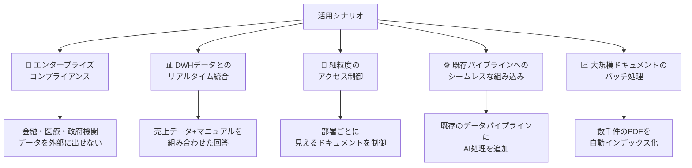
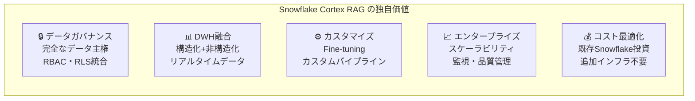

# NotebookLM などとの差別化を目指すには

## 比較概要

| 観点 | Snowflake Cortex RAG | NotebookLM (Google) | 一般的な RAG SaaS |
|------|---------------------|---------------------|-------------------|
| データ保管場所 | Snowflake 内（自社管理） | Google クラウド | ベンダー依存 |
| 既存データとの統合 | ネイティブ（DWH と同一） | 不可 | 要ETL |
| カスタマイズ性 | 高（SQL/Python で自由） | 低 | 中程度 |
| スケーラビリティ | Snowflake に準拠 | 制限あり | ベンダー依存 |
| コスト構造 | Snowflake クレジット | 月額固定/従量 | 月額固定が多い |
| セキュリティ制御 | Snowflake RBAC 完全適用 | Google 標準 | 限定的 |
| 対応データ形式 | 構造化+非構造化 | 主に非構造化 | 非構造化中心 |

---

## Snowflake Cortex RAG が優位なシナリオ



---

## 差別化戦略 1: 構造化データ + ドキュメントのハイブリッド検索

NotebookLM では不可能な、**DWH のリアルタイムデータとドキュメントを組み合わせた回答**を実現します。

```sql
-- 例: 売上実績データ + 製品マニュアルを組み合わせたQ&A

-- 売上テーブル（構造化データ）
CREATE TABLE sales_data (
    product_id   VARCHAR,
    product_name VARCHAR,
    sales_amount NUMBER,
    sales_date   DATE
);

-- 質問: 「今月最も売れた製品の使用方法を教えてください」
WITH top_product AS (
    -- Step 1: リアルタイム売上データから製品を特定
    SELECT
        product_name,
        SUM(sales_amount) AS total_sales
    FROM sales_data
    WHERE sales_date >= DATE_TRUNC('month', CURRENT_DATE())
    GROUP BY product_name
    ORDER BY total_sales DESC
    LIMIT 1
),
query_context AS (
    SELECT
        product_name,
        -- Step 2: 製品名を動的にクエリに組み込む
        product_name || 'の使用方法と注意事項を教えてください' AS query
    FROM top_product
),
enriched_query AS (
    SELECT
        q.product_name,
        q.query,
        SNOWFLAKE.CORTEX.EMBED_TEXT_768('snowflake-arctic-embed-m', q.query) AS query_vec
    FROM query_context q
),
relevant_chunks AS (
    SELECT
        e.product_name,
        e.query,
        c.chunk_text,
        VECTOR_COSINE_SIMILARITY(c.chunk_vec, e.query_vec) AS score
    FROM enriched_query e
    CROSS JOIN doc_chunks_with_vec c
    WHERE c.file_name LIKE '%' || e.product_name || '%'
    ORDER BY score DESC
    LIMIT 3
)
SELECT
    product_name AS "製品名",
    SNOWFLAKE.CORTEX.COMPLETE(
        'llama3.1-70b',
        CONCAT(
            '製品マニュアルを参考に以下の質問に答えてください:\n',
            query, '\n\n参考文書:\n',
            LISTAGG(chunk_text, '\n\n')
        )
    ) AS "AI回答"
FROM relevant_chunks
GROUP BY product_name, query;
```

---

## 差別化戦略 2: 行レベルセキュリティ（RLS）との統合

```sql
-- 部署ごとに閲覧できるドキュメントを制限する RLS ポリシー
CREATE OR REPLACE ROW ACCESS POLICY document_access_policy
ON doc_chunks_with_vec
AS (row_data doc_chunks_with_vec) -> BOOLEAN
USING (
    -- 現在のユーザーの部署を確認
    EXISTS (
        SELECT 1 FROM user_department_mapping
        WHERE user_name = CURRENT_USER()
        AND department = (
            SELECT department
            FROM document_department_mapping
            WHERE file_name = row_data.file_name
        )
    )
    OR CURRENT_ROLE() = 'ADMIN'
);

-- ポリシーの適用
ALTER TABLE doc_chunks_with_vec
ADD ROW ACCESS POLICY document_access_policy ON (file_name);

-- これにより、営業部のユーザーは人事部の文書を検索結果に含めない
-- アプリ側での制御不要！Snowflakeが自動的に適用
```

---

## 差別化戦略 3: 多言語・ドメイン特化対応

```sql
-- 多言語ドキュメントの自動翻訳 + インデックス化
CREATE OR REPLACE PROCEDURE index_multilingual_document(
    file_name     VARCHAR,
    content       VARCHAR,
    source_lang   VARCHAR DEFAULT 'auto'
)
RETURNS VARCHAR
LANGUAGE SQL
AS
$$
DECLARE
    translated_content VARCHAR;
    chunk_count NUMBER DEFAULT 0;
BEGIN
    -- 日本語以外は翻訳
    IF source_lang != 'ja' THEN
        SELECT SNOWFLAKE.CORTEX.TRANSLATE(
            :content, :source_lang, 'ja'
        ) INTO translated_content;
    ELSE
        SET translated_content = content;
    END IF;

    -- チャンク化 + ベクトル化（日本語で統一）
    INSERT INTO doc_chunks_with_vec (doc_id, file_name, chunk_text, chunk_index, chunk_vec)
    WITH chunks AS (
        SELECT
            UUID_STRING() AS doc_id,
            :file_name AS file_name,
            value::VARCHAR AS chunk_text,
            index AS chunk_index
        FROM TABLE(FLATTEN(SPLIT(:translated_content, '\n')))
        WHERE TRIM(value::VARCHAR) != ''
    )
    SELECT
        doc_id, file_name, chunk_text, chunk_index,
        SNOWFLAKE.CORTEX.EMBED_TEXT_768('snowflake-arctic-embed-m', chunk_text)
    FROM chunks;

    SELECT COUNT(*) INTO chunk_count
    FROM doc_chunks_with_vec
    WHERE file_name = :file_name;

    RETURN '処理完了: ' || chunk_count || ' チャンク（' || source_lang || ' → ja）';
END;
$$;

-- 英語ドキュメントを日本語に翻訳してインデックス化
CALL index_multilingual_document(
    'product_manual_en.txt',
    'This product manual covers installation and operation...',
    'en'
);
```

---

## 差別化戦略 4: Fine-tuning による社内特化モデル

```sql
-- Cortex Fine-tuning でドメイン特化モデルを作成
-- （訓練データを用意する）
CREATE TABLE fine_tune_training_data (
    prompt    VARCHAR,  -- 質問
    completion VARCHAR  -- 期待される回答
);

INSERT INTO fine_tune_training_data VALUES
('Snowflakeのウェアハウスを停止するには？',
 '仮想ウェアハウスの停止はALTER WAREHOUSE <name> SUSPEND;で実行できます。自動停止はAUTO_SUSPEND設定で管理します。'),
('クエリが遅い原因を調べるには？',
 'QUERY_HISTORYビューやExplain Planを使用します。SELECT * FROM TABLE(INFORMATION_SCHEMA.QUERY_HISTORY()) ORDER BY TOTAL_ELAPSED_TIME DESC LIMIT 10;で遅いクエリを特定できます。');

-- Fine-tuning ジョブの作成
SELECT SNOWFLAKE.CORTEX.FINETUNE(
    'CREATE',                          -- アクション
    'my_custom_snowflake_model',       -- カスタムモデル名
    'mistral-7b',                      -- ベースモデル
    'SELECT prompt, completion FROM fine_tune_training_data',  -- 訓練データ
    'SELECT prompt, completion FROM fine_tune_training_data SAMPLE (20 ROWS)'  -- 検証データ
);

-- ジョブ状態の確認
SELECT SNOWFLAKE.CORTEX.FINETUNE('DESCRIBE', 'my_custom_snowflake_model');

-- Fine-tuned モデルを使ってRAG
SELECT SNOWFLAKE.CORTEX.COMPLETE(
    'my_custom_snowflake_model',  -- 社内特化モデルを使用
    CONCAT(context_text, '\n\n', user_query)
) AS specialized_answer
FROM rag_context;
```

---

## 差別化戦略 5: 監視・品質管理の自動化

```sql
-- RAG 品質モニタリングテーブル
CREATE TABLE rag_quality_log (
    log_id          VARCHAR DEFAULT UUID_STRING() PRIMARY KEY,
    query           VARCHAR,
    answer          VARCHAR,
    retrieved_chunks VARIANT,
    max_similarity  FLOAT,
    avg_similarity  FLOAT,
    model_used      VARCHAR,
    latency_ms      NUMBER,
    user_feedback   VARCHAR,  -- 'good' / 'bad' / null
    logged_at       TIMESTAMP DEFAULT CURRENT_TIMESTAMP()
);

-- 品質分析クエリ
SELECT
    DATE_TRUNC('day', logged_at) AS date,
    COUNT(*) AS query_count,
    AVG(max_similarity) AS avg_max_similarity,
    AVG(latency_ms) AS avg_latency_ms,
    SUM(CASE WHEN user_feedback = 'good' THEN 1 ELSE 0 END) AS good_feedback,
    SUM(CASE WHEN user_feedback = 'bad' THEN 1 ELSE 0 END) AS bad_feedback,
    ROUND(
        SUM(CASE WHEN user_feedback = 'good' THEN 1 ELSE 0 END) * 100.0 /
        NULLIF(SUM(CASE WHEN user_feedback IS NOT NULL THEN 1 ELSE 0 END), 0),
        2
    ) AS satisfaction_rate_pct
FROM rag_quality_log
GROUP BY date
ORDER BY date DESC;

-- 低品質クエリの分析（改善候補）
SELECT
    query,
    max_similarity,
    answer
FROM rag_quality_log
WHERE
    (max_similarity < 0.6 OR user_feedback = 'bad')
    AND logged_at >= DATEADD(day, -7, CURRENT_TIMESTAMP())
ORDER BY max_similarity ASC
LIMIT 20;
```

---

## 価値提案のまとめ



---

## 次のステップ

- [Cortex Search の詳細](./03_cortex_search.md) - エンタープライズ向け検索サービスの全機能
